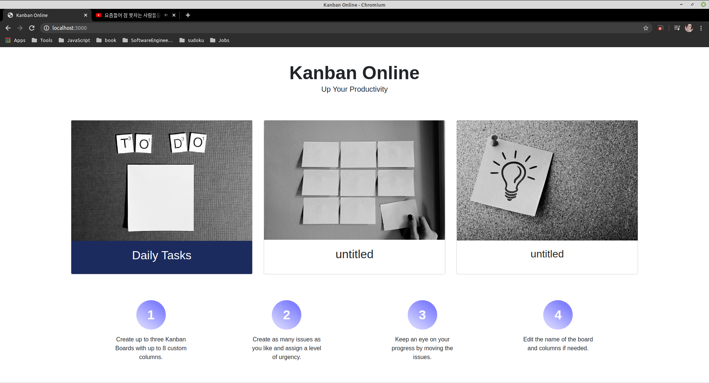
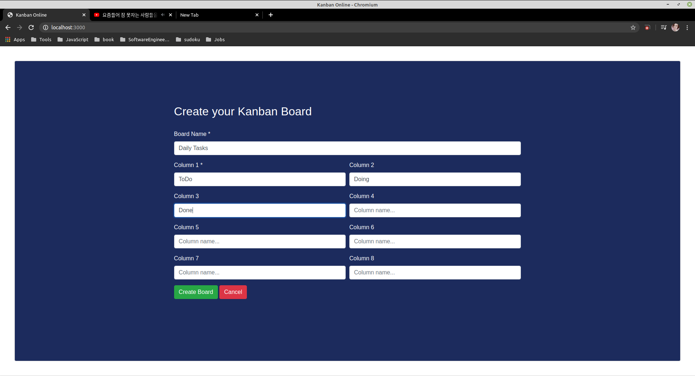
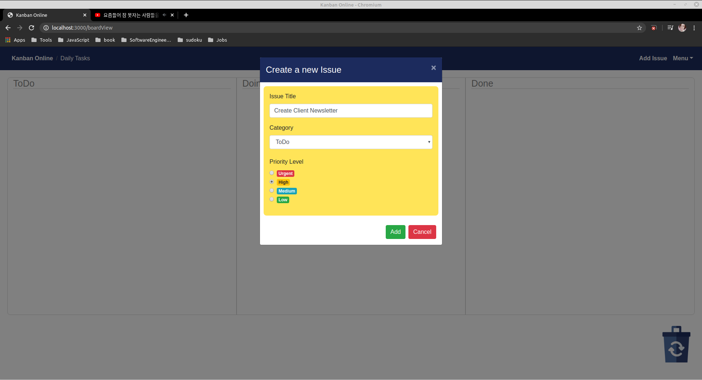
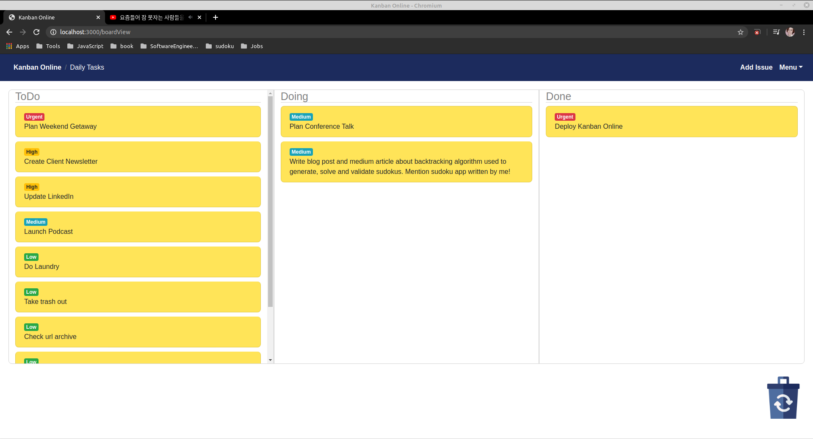

# Kanban Online

The app is written in Javascript, works with React and uses bootstrap-react.

---

### Create a Board

Create up tp three boards with up to 8 columns, board and columns can be renamed later on if needed.

---

### Create as many issues as you like

Create issues, choose level of urgency and category.

---

### Keep an eye on your progress

Move issues from column to column as a visual representation of your progress.

